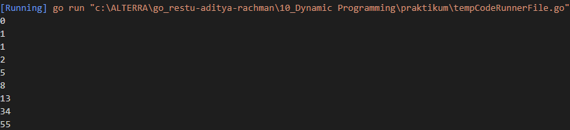
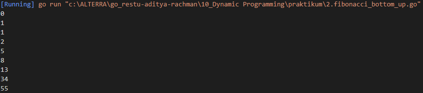
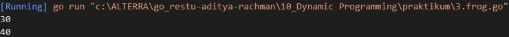

# Resume Dynamic Programming

1. Dynamic programming merupakan algoritma teknik untuk menyelesaikan problem secara optimal. dengan memecahkan problem tersebut kedalam problem problem yang lebih mudah atau gampang.  
2. karakter dari dynamic programming diantaranya adalah overlapping subproblem, yaitu ketika kita mencari solusi maka subproblem akan dipanggil beberapa kali maka kita mengetahui bahwa problem tersebut akan dilakukan berkali kali yang akan digambarkan dengan tree. yang kedua adalah optimal substructure property, jadi setiap problem harus menggunakan problem itu sendiri atau harus optimal.
 
3. metode pada dynamic programming adalah, top down with memoization, yang merupakan pemecahan masalah menggunakan recursive jadi ketika telah memecahkan subproblem tertentu dia akan menyimpan hasilnya ke subdata yang temporary, dengan begitu tidak perlu menyelesaikan masalah tersebut berulang-ulang. method berikutnya adalah botton-up tabulation, yang merupakan opposite dari top-down yang menghindari rekursif jadi dia akan menyelesaikan masalah dari yang terkecil.
 

# Task
## Problem 1 - Compare String
Solusi: [1.simple_equations.go](./praktikum/1.fibonacci_top_down.go)

Output:

## Problem 2 - Caesar Cipher

Solusi: [2.money_coins.go](./praktikum/2.fibonacci_bottom_up.go)

Output:

## Problem 3 - Swap Two Number Using Pointer
Solusi: [3.dragon_of_loowater.go](./praktikum/3.frog.go)

Output:
