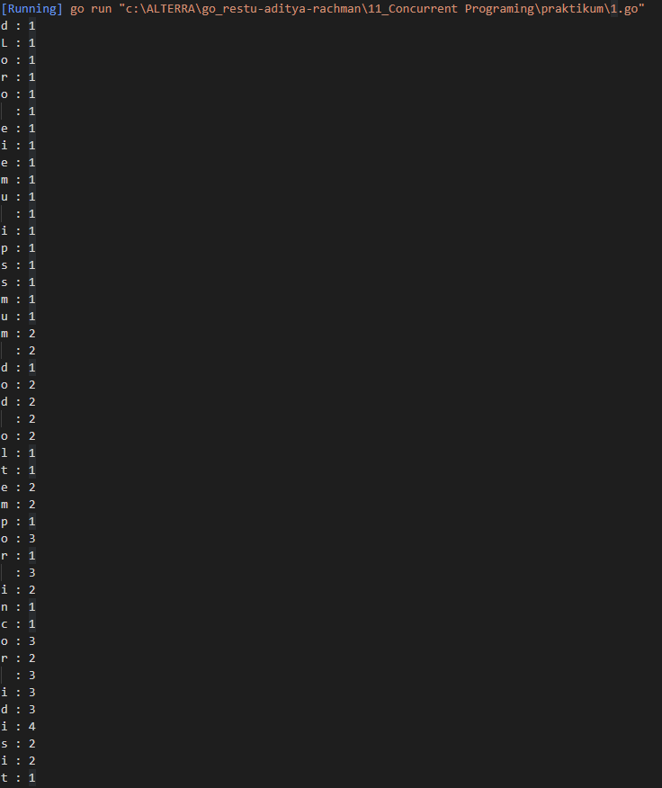
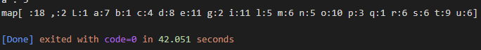

# Resume Concurrent Programing

1. sequential program adalah penyelesaian masalah secara berurutan. parallel program merupakan penyelesaian masalah secara bersamaan atau simultan, syaratnya pada processor harus multi-core. concurent program adalah penyelesaian masalah secara bersamaan dan independen atau berdiri sendiri yang tidak memerlukan multi-core. jika program dijalankan secara concurent dan ditambah multi core maka dia akan menjalankan concurency dengan parallelisme.
2. goroutines adalah function yang ditentukan berjalan secara concurency yang dijalankan didalam golang. channels merupakan komunikasi ketika concurency untuk menentukan mana yang akan dieksekusi terlebih dahulu. Select adalah untuk mengontrol jalannya concurent yang berjalan didalam channel. terdapat 2 jenis proses yang berjalan didalan cpu kita, yaitu concurent atau thread. thread adalah proses unit didalam CPU kita.
3. Channel merupakan komunikasi objek yang menggunakan goroutines yang dapat berkomunikasi satu sama lain. channel hanya dapat menyimpan satu data. unbuffered adalah channel yang tidak mengalokasikan data sedangkan buffered channels merupakan channels yang dapat mengalokasikan data. Select berfungsi untuk mengontrol komunikasi antara channels. Race condition adalah kelemahan dari penggunaan goroutines dimana 2 goroutines akan balapan untuk mengakses file yang sama, ini bisa di handle dengan cara melakukan lock ke salah satu variable. ada juga channel blocking untuk mensinkronisasi antar go routine. terakhir ada mutex yaitu untuk menunggu dan mengunci variabel
## Problem 1 

Solusi: [1.go](./praktikum/1.go)

Output:

