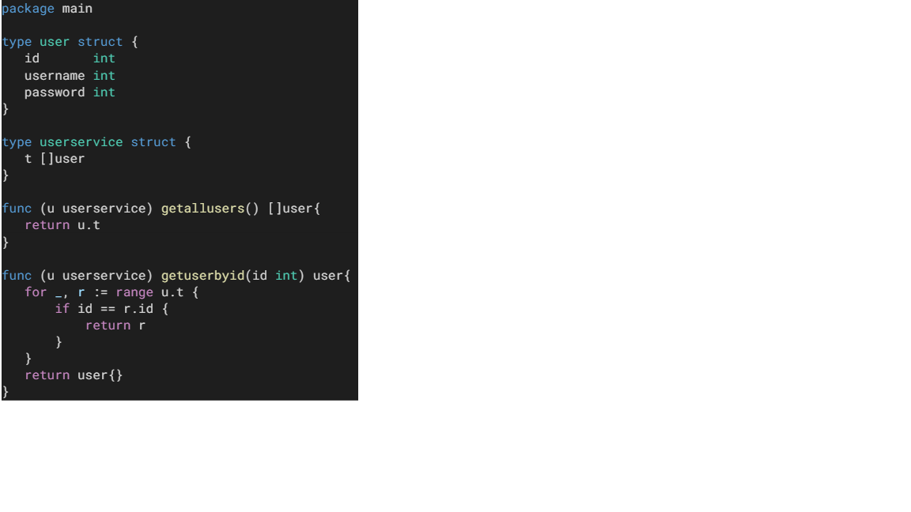

Pada kode diatas memiliki beberapa kekurangan sebagai berikut
1. Tidak menerapkan format penusial seperti camel case
2. Terdapat beberapa variabel yang tidak mudah dipahami seperti t pada class userservice dan u pada parameter method userservice. sebaiknya variabel tersebut berupa kata jangan hanya 1 huruf saja