1. Deploy you application by using kubectl from local machine
    * Containerize go app (docker build)
    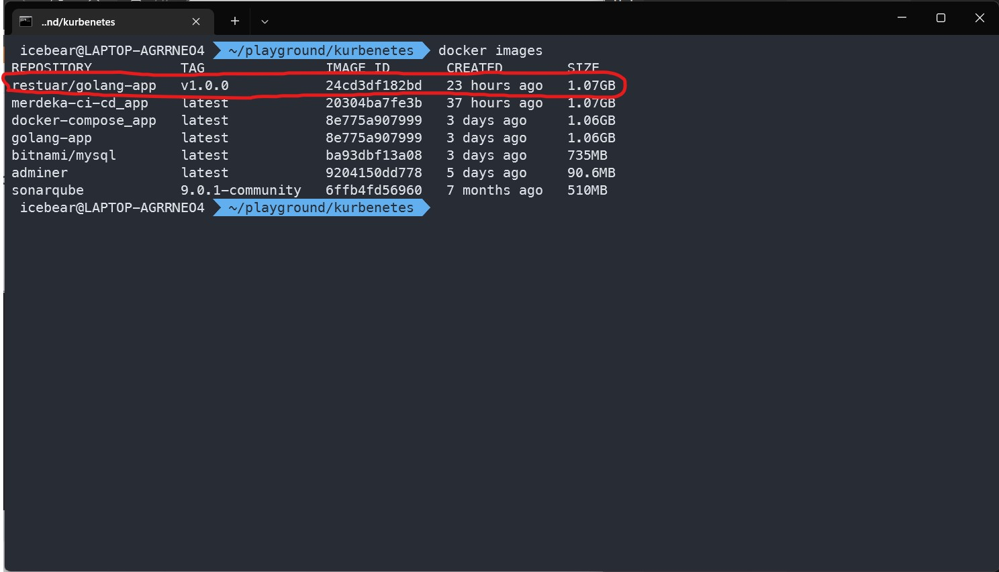
    * push to image registry (docker push)
    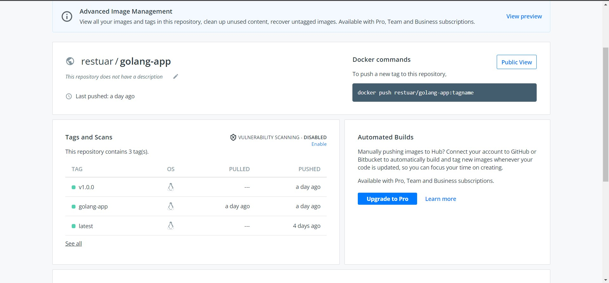
    * Create kubernetes manifest
    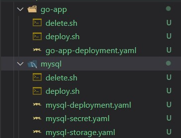
    * Tru to perform kubectl apply
    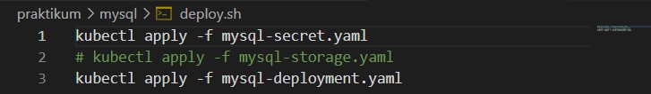
    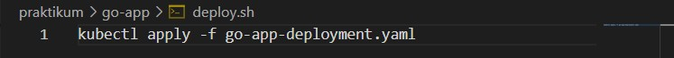

# Result 
1. Deploy MYSQL
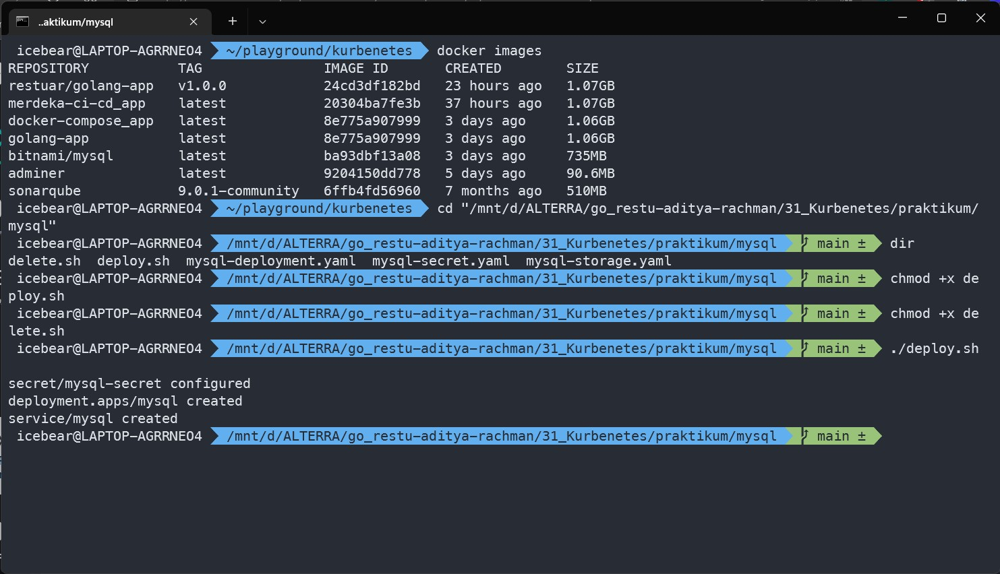
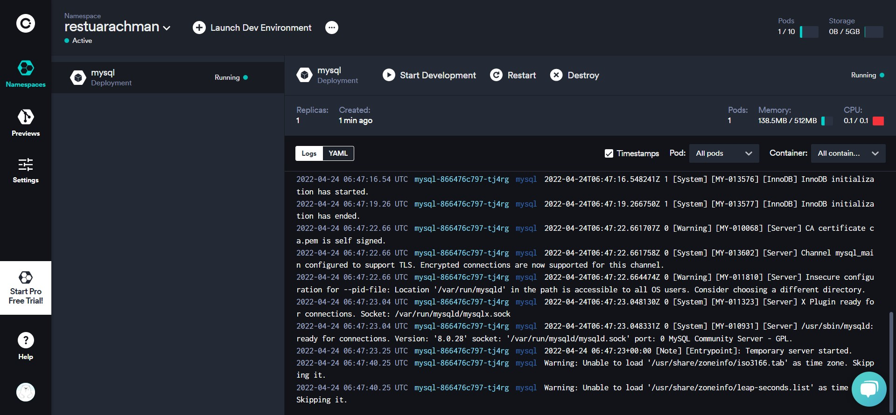
2. Deploy go-app
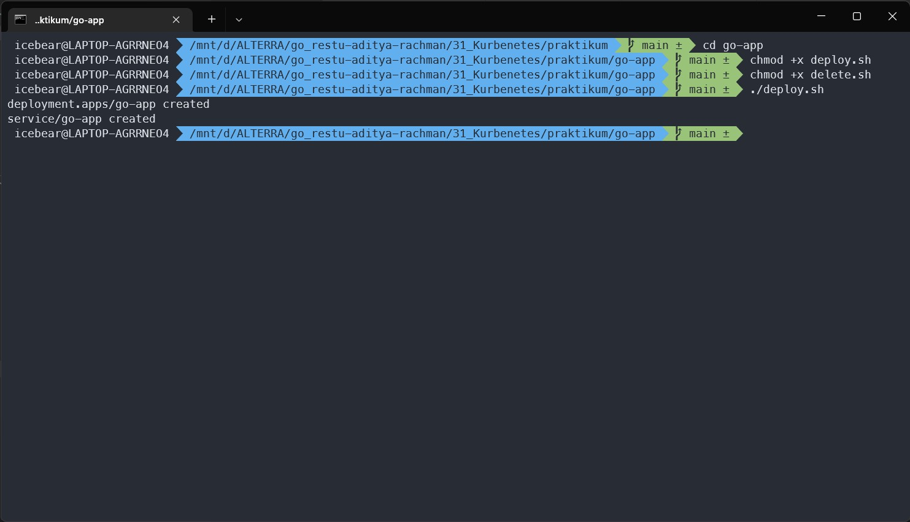
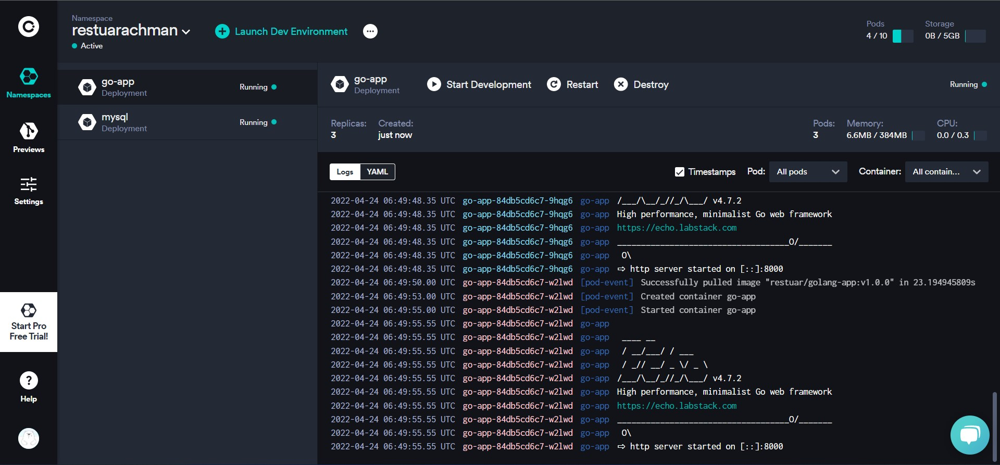
3. Test app on Postman
    * Port forward deployment `kubectl port-forward deployment/go-app 8000:8000`
    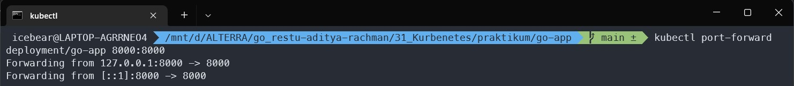
    * Test on postman using port forward (`localhost:8000`)
    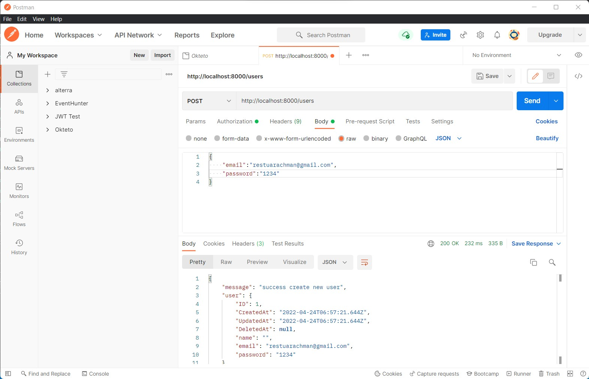

