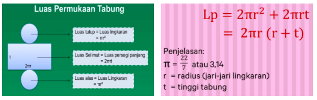
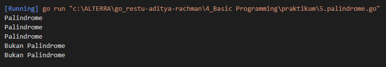

# Resume Basic Programming

1. Variable pada programming digunakan untuk menyimpan sebuah informasi di dalam program komputer. ada beberapa data yang dapat disimpan didalam variable seperti data berupa boolean, numeric, dan string. Pada golang untuk membuat variable terdapat beberapa cara seperti dibawah ini 
  - `var <nama_variable> <tipe_data>`
  - `var <nama_variable> <tipe_data> = <values>`
  - `<nama_variable> := <values>`
  - dan seterusnya
2. Pada golang juga terdapat arithmetic operators biasanya digunaka untuk perhitungan. pada golang sendiri terdiri dari beberapa operators serperti dibawah ini 
  - +(addition)
  - -(subtraction)
  - /(division)
  - *(multification)
  - %(modulo)
  - ++(increament)
  - --(decreament)

3. Control Structures digunakan untuk percabangan dan perulangan pada pemrograman. Pada golang percabangan dapat menggunakan if dan switch. Selain percabangan ada juga looping, looping pada golang dapat menggunakan for, dan while

# TASK
### Problem 1
Pada task ini, membuat sebuah program Untuk mengeluarkan luas tabung. Saya perlu tau rumusnya terlebih dahulu. untuk rumusnya sendiri yaitu seperti gambar dibawah ini 

Dengan rumus tersebut maka saya dapat menghitungnya dengan cara seperti kodingan berikut [1.luas_tabung.go](./praktikum/1.luas_tabung.go)

## Problem 2
Pada task ini program melakukan konversi dari nilai skala 0-100 menjadi A-E dengan ketentuan sebagai berikut

- Nilai 80 - 90 --> A
- Nilai 65 - 79 --> B
- Nilai 50 - 64 --> C
- Nilai 35 - 49 --> D
- Nilai 0 - 34 --> E
- Nilai kurang dari 0 atau lebih dari 100 maka tampilkan 'Nilai Invalid'

Berikut kode dari hasil praktikum ini
[2.grade_nilai.go](./praktikum/2.grade_nilai.go)

## Problem 3
Membuat sebuah program untuk mencetak faktor sebuah bilangan

Sample Test Cases

Input : 6

Output : 

1

2

3

6

Input : 20

Output : 

1

2

3

5

10

20

berikut solusi dalam bentuk program dari permasalahan diatas
[3.faktor_bilangan.go](./praktikum/3.faktor_bilangan.go)

## Problem 4
Dalam task ini, membuat sebuah program untuk menampilkan bilangan prima atau bukan dari suatu input

Sample Test Cases

Input : 7

Output: Bilangan Prima

Input : 10

Output: Bukan Bilangan Prima
[4.bilangan_prima.go](./praktikum/4.bilangan_prima.go)

Output:

## Problem 5
Membuat program untuk mendeteksi sebuah string apakah merupakan kata palindrome atau bukan. Berikut adalah hasil program dari permasalahan tersebut
[5.palindrome.go](./praktikum/5.palindrome.go)

Output:

## Problem 6
Membuat program untuk mempangkatkan suatu bilangan. misa x = 2, n = 3 maka artinya adalah 2 pangkat 3 = 8. Berikut adalah hasil program dari permasalahan tersebut
[6.exponentiation.go](./praktikum/6.exponentiation.go)

Output: 

## Problem 7
Membuat sebuah program untuk mengeluarkan pola asterisk dengan menggunakan looping. berikut hasil dari task tersebut 
[7.asterisk.go](./praktikum/7.asterisk.go)

Output: 

## Problem 8
Membuat tabel perkalian dengan panjang tabel n x n. berikut hasil dari task tersebut
[8.cetak_tabel_perkalian.go](./praktikum/8.cetak_tabel_perkalian.go)

