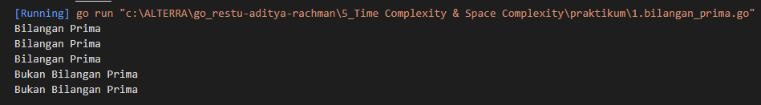
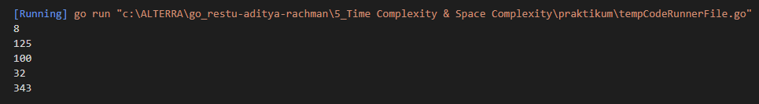
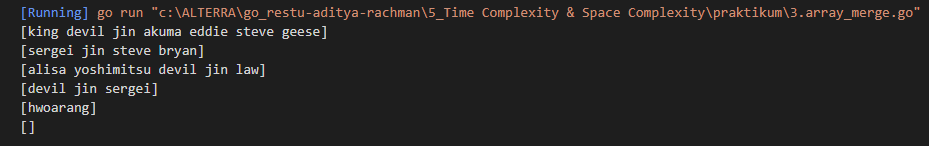
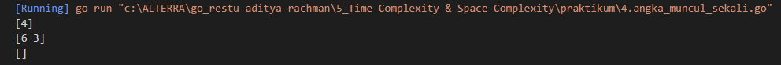
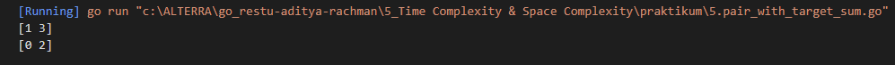

# Resume Time Complexity & Space Complexity

1. Time Complexity memudahkan untuk memperkirakan running time sebuah program. Time Complexity dapat dilihat sebagai jumlah maksimum oprasi primitif yang dapat dijalankan oleh suatu program pada komputer tertentu. sebagian besar time complexity dapat dihitung berdasarkan jumlah statement, looping, dan percabangan.

2. Time Complexity memiliki beberapa jenis dari yang tercepat dan terlambat seperti dibawah ini
- Constant time - O(n)
- Linear time - O(n+m)
- Logaritmic time - O(log n)
- Quadratic time - O(n^2)
- factorial time - O(n!) dan exponential time O(2^n)

3. Space Complexity merupakan batasan memori yang dapat ditampung oleh suatu memori. dengan Space Complexity kita dapat memperkirakan jumlah variabel yang dapat kita deklarasikan dalam program. misalkan kita memiliki array sepanjang n maka space complexity yang kita punya dalam notasi Big-O adalah linear time - O(n)

# Task
## Problem 1 - Bilangan Prima
Dalam matematika, bilangan prima adalah bilangan asli yang lebih besar dari angka 1, yang faktor pembaginya adalah 1 dan bilangan itu sendiri. 2 dan 3 adalah bilangan prima. 4 bukan bilangan prima karena 4 bisa dibagi 2. Kamu diminta untuk membuat fungsi untuk menentukan bahwa sebuah bilangan termasuk bilangan prima atau tidak.

Buatlah solusi yang lebih optimal, dengan kompleksitas lebih cepat dari O(n) / O(n/2).
<pre>
Sample Test Cases
Input: 1000000007
Output: Bilangan Prima

Input: 1500450271
Output: Bilangan Prima
</pre>
Berikut solusi yang telah saya kerjakan 

[1.bilangan_prima.go](./praktikum/1.bilangan_prima.go)

Output :

## Problem 2 - Fast Exponentiation
Given two integers x and n, write a function to compute x^n. We may assume that x and n are small and overflow doesn’t happen.

Create optimal solution with time complexity more fast that O(n). -> logarithmic
<pre>
Sample Test Cases
Input : x = 2, n = 3
Output : 8

Input : x = 7, n = 2
Output : 49
</pre>
Berikut solusi yang telah saya buat 

[2.fast_exponentiation.go](./praktikum/2.fast_exponentiation.go)

Output :

## Problem 3 - Array Merge
Problem 3 - Array Merge
Buatlah sebuah program menggabungkan 2 array yang diberikan, dan jangan sampai terdapat nama yang sama di data yang sudah tergabung tadi. (Structure Data , No BruteForce)
<pre>
Sample Test Cases
Input: ['kazuya', 'jin', 'lee'], ['kazuya', 'feng']
Output: ['kazuya', 'jin', 'lee', 'feng']

Input: ['lee', 'jin'], ['kazuya', 'panda']
Output: ['lee', 'jin', 'kazuya', 'panda']
</pre>

Berikut solusi yang telah saya buat 

[3.array_merge.go](./praktikum/3.array_merge.go)

Output: 

## Problem 4 - Angka Muncul Sekali

Buat program sesuai dengan deskripsi di bawah. Input merupakan variable string berisi kumpulan angka. Output merupakan list / array berisi angka yang hanya muncul 1 kali pada input.
<pre>
Sample Test Case

Input: “76523752”
Output: [6, 3]

Input: “1122”
Output: []
</pre>

Berikut solusi yang telah saya buat

[4.angka_muncul_sekali.go](./praktikum/4.angka_muncul_sekali.go)

Output:

## Problem 5 - Pair With Target Sum
Given an array of sorted numbers and a target sum, find a pair in the array whose sum is equal to the given target.

Write a function to return the indices of the two numbers (i.e. the pair) such that they add up to the given target.

Challenges:
Solve with linear complexity O(n), not O(n^2) if you can!
<pre>
Sample Test Cases
Input: [1, 2, 3, 4, 6], target=6
Output: [1, 3]
Explanation: The numbers at index 1 and 3 add up to 6: 2+4=6

Input: [2, 5, 9, 11], target=11
Output: [0, 2]
Explanation: The numbers at index 0 and 2 add up to 11: 2+9=11
</pre>

Berikut solusi yang telah saya buat 

[5.pair_with_target_sum.go](./praktikum/5.pair_with_target_sum.go)

Output:
