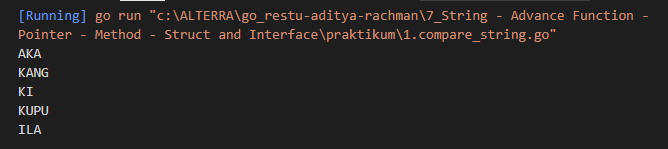
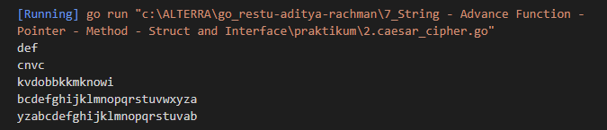
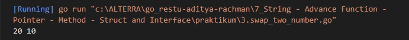
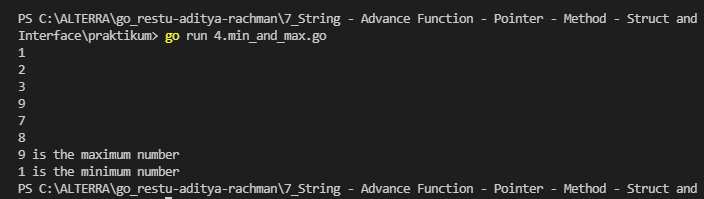
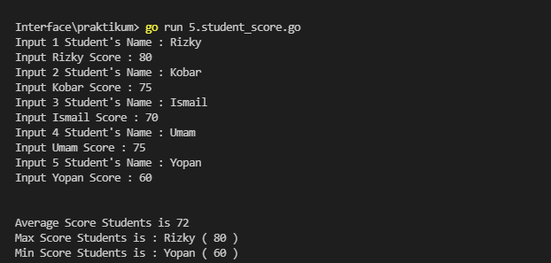
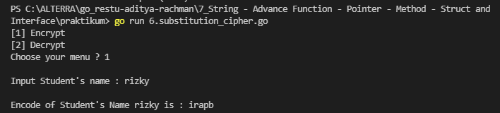

# Resume String - Advance Function - Pointer - Method - Struct and Interface

1. String merupakan salah satu tipe data yang ada pada pemrograman  
len() -> untuk menghitung panjang string  
compare -> untuk membandingkan 2 buah string 
replace -> untuk mengganti char tertentu yang ada pada sebuah string  
insert -> untuk menambahkan beberapa char pada sebuah string.   Selain string ada juga function. Function berguna untuk membuat sebuah algoritma kecil pada pemrgoraman yang nantinya dapat dipanggil untuk menjalankanya. hal ini sangat berguna karena dapat membuat code menjadi lebih rapih dan mudah untuk dipahami

2. Pointer adlaah sebuah variabel yang dapat menyimpan memory address dari variabel lain. Pointer meiliki kemampuan untuk mengubah data yang telah di simpanya.

3. Struct adalah user-defined type yang memiliki beberapa variabel atau function (method)

# Task
## Problem 1 - Compare String
Solusi: [1.compare_string.go](./praktikum/1.compare_string.go)

Output:

## Problem 2 - Caesar Cipher

Solusi: [2.caesar_cipher.go](./praktikum/2.caesar_cipher.go)

Output:

## Problem 3 - Swap Two Number Using Pointer
Solusi: [3.swap_two_number.go](./praktikum/3.swap_two_number.go)

Output:

## Problem 4 - Min and Max Using Pointer
Solusi: [4.min_and_max.go](./praktikum/4.min_and_max.go)

Output:

## Problem 5 - Student Score
Solusi: [5.student_score.go](./praktikum/5.student_score.go)

Output:

## Problem 6 - Substitution Cipher
Solusi : [6.substitution_cipher.go](./praktikum/6.substitution_cipher.go)

Output:
