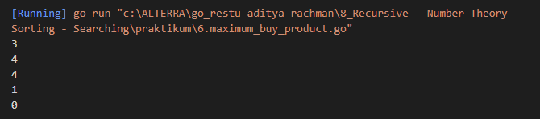
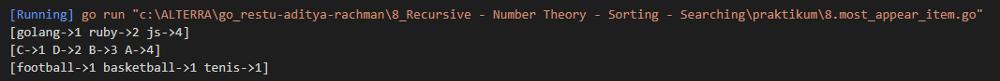

# Resume Recursive - Number Theory - Sorting - Searching
1. Recursion is a state is which a function solves a problem by calling itself repeatedly. if the problem is small enough, the recursion function can generate an immediate answer. if the problem is too big, the function will call itself with the smaller problem scope.  
Why we need recursion?  
\- Many problems are easier to solve and shorten the code when using a recursive approach   
\- Bassically, both iterative (eg with a for loop) and recursive strategy do something repetitive.  
\- However, sometimes iterative solutions to a problem are very difficult to think of and require special techniques.  
\- With recursive solutions, it may be easier to view and design a path for completion.

 2. Number theory is a branch of matheatics that studies integers. There are a lot of topics in the field of number theory is Prime Number, Greatest Common Divisor, Least Common Multiple, Factorial, Prime, Factor, Etc.

 3. Searching is the process of finding a given value position in a list of values. And sorting is the process of arraging data in a certain order. Usually, we sort by the value of the elements. We can sort numbers, words, pairs, etc. For example, we can sort students by their height, and we can sort cities in alphabetical order or by their numbers of citizens. The most-user orders are numerical order and alphabetical order.
# Task
## Problem 1 - Prima ke X
Solusi: [1.prima_ke_x.go](./praktikum/1.prima_ke_x.go)

Output:

## Problem 2 - Fibonacci (Recursive)

Solusi: [2.fibonacci.go](./praktikum/2.fibonacci.go)

Output:

## Problem 3 - Prima Segi Empat
Solusi: [3.prima_segi_empat.go](./praktikum/3.prima_segi_empat.go)

Output:

## Problem 4 - Total Maksimum Dari Deret Bilangan
Solusi: [4.total_maksimum_dari_deret_bilangan.go](./praktikum/4.total_maksimum_dari_deret_bilangan.go)

Output:

## Problem 5 - Find Min and Max Number
Solusi: [5.find_min_and_max_number.go](./praktikum/5.find_min_and_max_number.go)

Output:

## Problem 6 - Maximum Buy Product
Solusi : [6.maximum_buy_product.go](./praktikum/6.maximum_buy_product.go)

Output:

## Problem 7 - Playing Domino
Solusi : [7.playing_domino.go](./praktikum/7.playing_domino.go)

Output:

## Problem 8 - Most Appear Item
Solusi : [8.most_appear_item.go](./praktikum/8.most_appear_item.go)

Output:
