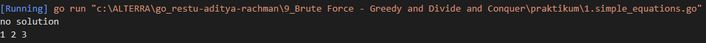
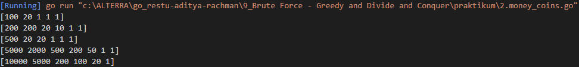
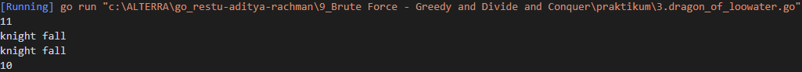
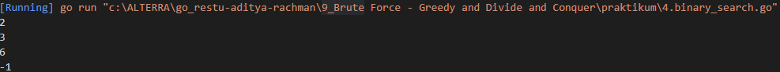

# Resume String - Advance Function - Pointer - Method - Struct and Interface

1. What is Problem Solving paradigm?  
Problem solving paradigms is approach commonly used to solve problems: Complete Search (Brute Force), Divide and Conquer, the Greedy approach, and Dynamic Programming, Every problem we need to solve with suitable approach.  
COMPLETE SEARCH
- Somplete Search (aslo known as) Bruteforce is a method for solving a progblem by traversing the entire search space to obtain the required solution.
-  Brutefoce happen when no other algorithm available.
- Usually easy to write because it's straightforward.
- Theorically all problem can be solved using Brute Force approach especially when you have unlimited time.

2. DIVIDE AND CONGQUER (D&C) 
Divide & Conquer (D&C) is a problem-solving paradigm in which a problem is made by simpler by 'dividing' it into smaller parts and then conquering each part. The Step:
- Divide: membagi masalah yang besar menjadi masalah yang lebih kecil
- Conquer: ketika masalah sudah cukup kecil untuk diselesaikan, langsung selesaikan
- Combine: jika dibutuhkan maka perlu menggabungkan solusi dari masalah-masalah yang lebih kecil menjadi solusi untuk masalah yang besar.

3. GREEDY 
An algorithm is said to be greedy if it makes the locally optimum choice at each step with the hope of eventually reaching the globally optimal solution. In some cases, greedy works - the solution is short and runs efficiently.

# Task
## Problem 1 - Compare String
Solusi: [1.simple_equations.go](./praktikum/1.simple_equations.go)

Output:

## Problem 2 - Caesar Cipher

Solusi: [2.money_coins.go](./praktikum/2.money_coins.go)

Output:

## Problem 3 - Swap Two Number Using Pointer
Solusi: [3.dragon_of_loowater.go](./praktikum/3.dragon_of_loowater.go)

Output:

## Problem 4 - Min and Max Using Pointer
Solusi: [4.binary_search.go](./praktikum/4.binary_search.go)

Output:
